# Liftory UI/UX Screen Gallery & Evaluation Guide

This document presents actual on-device screenshots of **Liftory (Native Android Offline-First Workout Tracker)** along with screen descriptions, design philosophy, ergonomic interactions, and UX evaluation criteria.

---

## 1. UI/UX Design Principles & Philosophy

1. **Thumb-Zone & Bottom-to-Top Ergonomics**:
   - Tailored for the gym environment where users stand between machines and log workouts with one hand. Key inputs and primary actions are grouped in the lower thumb-reach zone.
   - Set editor sheets employ a compact 3-column layout and automatic scrolling (`verticalScroll`) so that inputs and the save button remain 100% visible even with the virtual keyboard active.

2. **Zero Cognitive Load**:
   - Simplified 4-tab bottom navigation: **Sessions, Routines, Exercises, Stats**.
   - Smart dynamic adaptation: Choosing Cardio automatically switches labels and quick chips (`Weight/Reps/+2.5kg` ↔ `Speed/Time/+5min`), eliminating mode configuration overhead.

3. **Real-Time Visual Feedback**:
   - Dynamic 1RM feedback badge (`🔥 예상 1RM 106.7 kg`) calculates via Epley formula instantaneously as reps and weight are entered.
   - Auto-rest timer, persistent in-app banner (`ActiveWorkoutBanner`), and system status bar chronometer notification ensure seamless workout continuity across multitasking contexts.

4. **Single Active Session Rule**:
   - Reflects the physical reality that an individual can only perform one workout at a time. Concurrency is prevented with a clear conflict resolution dialog (Resume vs. Finish & Start New vs. Cancel).

---

## 2. Screen Gallery & Detailed UX Analysis

### [Screen 01] Workout Session Detail (Initial State)
- **File**: `01_session_detail_empty.png`
- **Category**: Workout Session Detail - Initial State

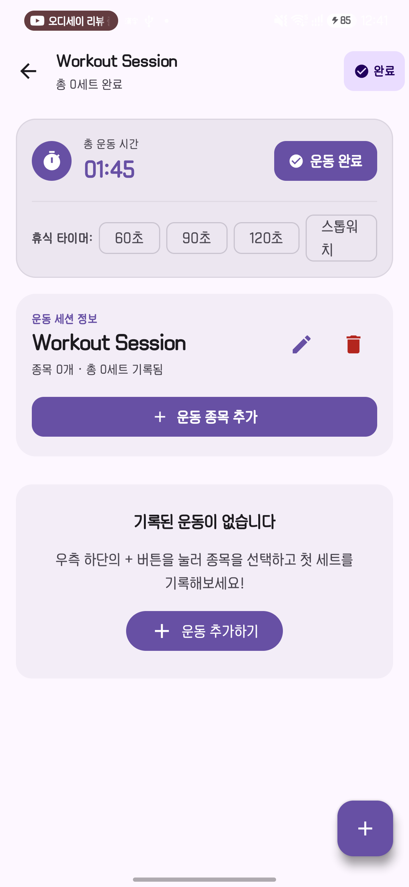

#### Key UI Elements
- **Header**: Back navigation, title, set counter (`총 0세트 완료`), top-right finish action (`[✓ 완료]`).
- **Live Stopwatch Dashboard**: Elapsed workout timer (`01:34`), primary `[✓ 운동 완료]` button.
- **Rest Timer Presets**: 1-touch chips for `60s`, `90s`, `120s`, `Stopwatch`.
- **Session Info Card**: Inline rename (pencil), delete (trash), `[+ 운동 종목 추가]` button.
- **Empty State Guidance**: Clear illustration and action prompt guiding the user to select an exercise.

#### UX Evaluation Criteria
- Immediate affordance guiding the user to their first action upon starting a workout.
- Clear hierarchical separation between time tracking and workout content.

---

### [Screen 02] Exercise Picker Modal (Cardio Filter)
- **File**: `02_exercise_picker_cardio.png`
- **Category**: Modal Bottom Sheet / Exercise Picker

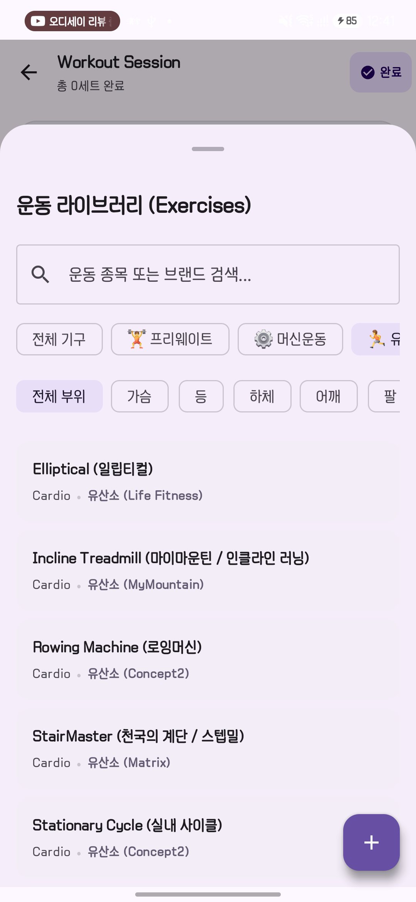

#### Key UI Elements
- **Search Bar**: Real-time filtering by exercise name or brand.
- **Equipment Filter Chips**: `All`, `🏋️ Free Weight`, `⚙️ Machine`, `🏃 Cardio`.
- **Muscle Group Filter Chips**: `All`, `Chest`, `Back`, `Legs`, `Shoulders`, `Arms`.
- **Exercise Card List**: Includes Treadmill, StairMaster (Matrix), Elliptical (Life Fitness), Rowing Machine (Concept2), Cycle (Concept2).

#### UX Evaluation Criteria
- Zero-latency filter transitions.
- Subtle brand sub-labels assisting users searching for specific gym equipment.

---

### [Screen 03] Weight Set Editor Sheet
- **File**: `03_set_editor_weight.png`
- **Category**: Input Bottom Sheet - Weight Training

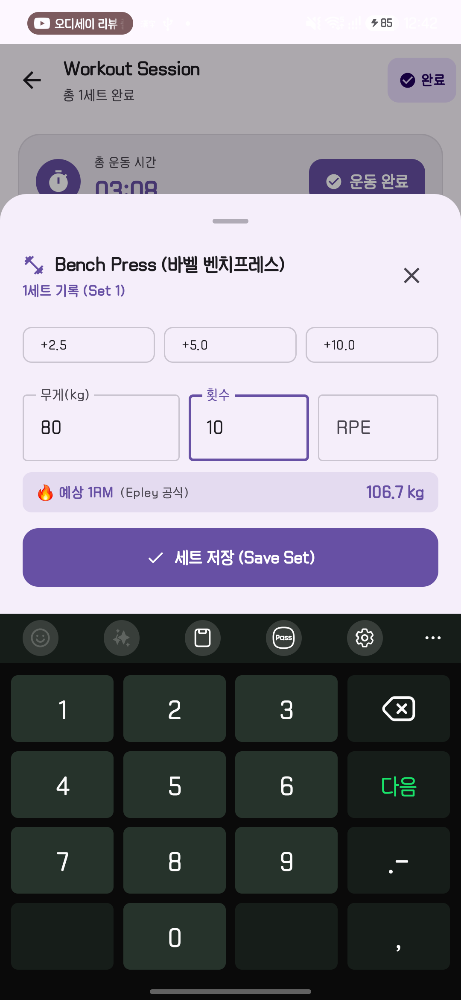

#### Key UI Elements
- **Header**: Dumbbell icon, exercise title (`Bench Press`), current set (`Set 1`), dismiss action.
- **Quick Weight Chips**: `[+2.5]`, `[+5.0]`, `[+10.0]` increments.
- **Horizontal 3-Column Layout**: `Weight(kg)`, `Reps`, `RPE` grouped in a single row.
- **Dynamic 1RM Feedback**: `🔥 예상 1RM (Epley 공식)  106.7 kg` badge appears immediately upon typing reps.
- **IME Navigation**: `Next` key jumps sequentially through fields and saves on Enter.

#### UX Evaluation Criteria
- Unobscured visibility of fields and save button while the keyboard is up.
- Instant motivational feedback via dynamic 1RM estimation.

---

### [Screen 04] Cardio Set Editor Sheet
- **File**: `04_set_editor_cardio.png`
- **Category**: Input Bottom Sheet - Cardio

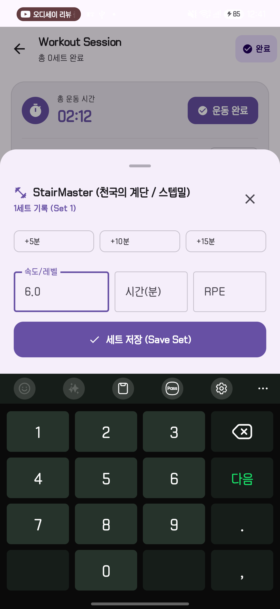

#### Key UI Elements
- **Smart Adaptive Labels**: Displays **`Speed/Level`** and **`Time(min)`** instead of Weight/Reps.
- **Cardio Quick Chips**: `[+5min]`, `[+10min]`, `[+15min]` 1-touch duration chips.
- **Decluttering**: Automatically hides irrelevant 1RM badge.

#### UX Evaluation Criteria
- Natural, friction-free adaptation to cardio metrics without user configuration.
- Large touch targets accessible even while moving on a machine.

---

### [Screen 05] Logged Workout Session with Dual Modalities
- **File**: `05_session_detail_logged.png`
- **Category**: Workout Session Detail - Active Workout with Sets

#### Key UI Elements
- **Auto-Rest Timer Dock**: Countdown bar (`⏳ 세트 간 휴식 중 01:28`) with `+30s`, `Pause(❚❚)`, `Dismiss(✕)`.
- **Cardio Table**: `Set | Speed/Level | Time(min) | RPE` headers and `1 | 8 | 15min | 8.0` data row.
- **Weight Table**: `Set | Weight | Reps | RPE` headers and `1 | 80.0 kg | 10 | -` data row.
- **Exercise Notes**: `[+ 종목 평가 / 피드백 남기기]` button per exercise.

#### UX Evaluation Criteria
- Harmonious coexistence of cardio and weight training data within the same session.
- Seamless hands-free rest timer activation upon saving a set.

---

### [Screen 06] Workout Completion Confirmation Dialog
- **File**: `05_session_finish_dialog.png`
- **Category**: Modal Dialog - Workout Completion

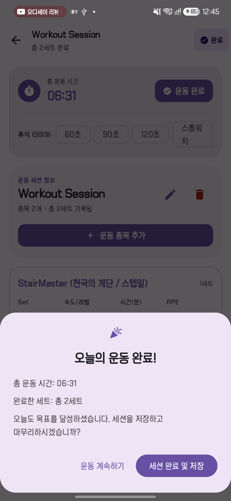

#### Key UI Elements
- **Celebration Header**: Party icon (`🎉`) with `오늘의 운동 완료!`.
- **Summary Metrics**: Total workout duration and completed set count.
- **Actions**: `운동 계속하기` (Resume) vs. `세션 완료 및 저장` (Finish & Save).

#### UX Evaluation Criteria
- Accidental tap prevention protecting active session records.
- Positive reinforcement upon concluding a session.

---

### [Screen 07] Single Active Session Conflict Resolution Dialog
- **File**: `07_session_conflict_dialog.png`
- **Category**: Interactive Conflict Dialog

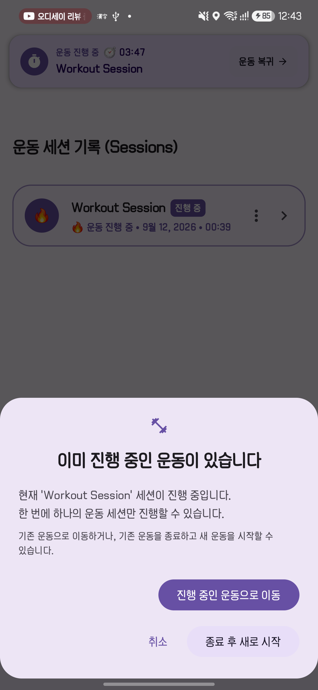

#### Key UI Elements
- **Notice Header**: `이미 진행 중인 운동이 있습니다`.
- **Context Description**: Explains that only one workout can be active at a time.
- **3-Way Options**:
  1. `진행 중인 운동으로 이동` (Primary purple action to resume).
  2. `종료 후 새로 시작` (Secondary action to finish current and create new).
  3. `취소` (Cancel).

#### UX Evaluation Criteria
- Safeguards data integrity while providing intuitive paths for the user.

---

### [Screen 08-A] Persistent In-App Active Banner & Session List (Active)
- **File**: `08_session_list_active.png`
- **Category**: Workout Session List - Active State

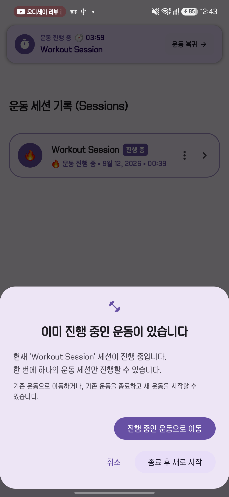

#### Key UI Elements
- **Top `ActiveWorkoutBanner`**: Real-time timer (`운동 진행 중 ⏱ 03:47`), session name, `[운동 복귀 >]` 1-touch return button.
- **Bento Session Card (`BentoSessionCard`)**:
  - Fire icon (`🔥`) and highlighted primary border.
  - `[진행 중]` badge and live status subtitle.
  - More options menu (`⋮`) and chevron navigation (`>`).

#### UX Evaluation Criteria
- Ambient UI keeping the user aware of their active workout across all app tabs.

---

### [Screen 08-B] Session List (Completed State)
- **File**: `08_session_list_completed.png`
- **Category**: Workout Session List - Completed State

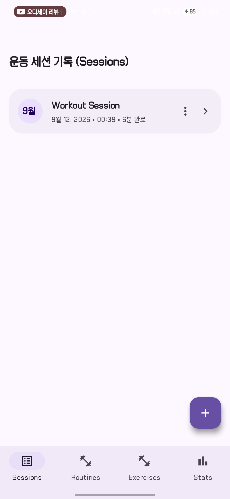

#### Key UI Elements
- **Banner Dismissal**: `ActiveWorkoutBanner` smoothly animates out (`shrinkVertically + fadeOut`) once finished.
- **Completed Card**: Displays duration (`6분 완료`), month calendar badge (`9월`), and clean borderless surface.

#### UX Evaluation Criteria
- Visual calmness signaling a completed workout.

---

### [Screen 09-A] Routine Template Library
- **File**: `09_routine_list.png`
- **Category**: Routines Tab

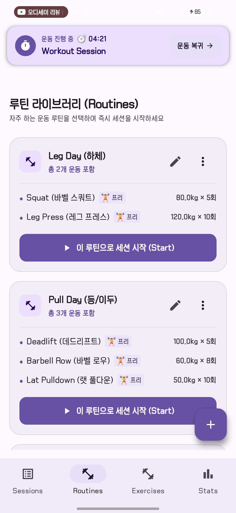

#### Key UI Elements
- **Header**: `루틴 라이브러리 (Routines)`.
- **Routine Bento Cards**: Includes routine name, total exercises, preview list with target presets (`80.0kg x 5회`), edit icon, and primary action button **`[▶ 이 루틴으로 세션 시작 (Start)]`**.
- **Floating Action Button**: `+` FAB for creating custom routines.

#### UX Evaluation Criteria
- High scannability: users review exercise presets without opening details.
- 1-touch workout instantiation from routine templates.

---

### [Screen 09-B] Routine Detail Editor Dialog
- **File**: `09_routine_editor_dialog.png`
- **Category**: Modal Dialog - Routine Editor

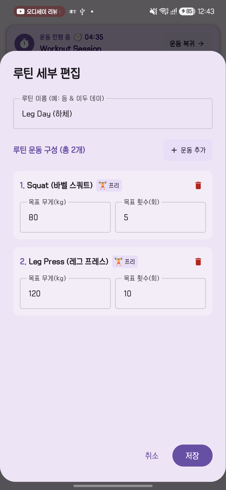

#### Key UI Elements
- Routine title field, `[+ 운동 추가]` exercise picker trigger, inline target weight/reps fields per exercise, item deletion, and `Cancel` / `Save` actions.

#### UX Evaluation Criteria
- Fast, inline configuration of multi-exercise workout plans.

---

### [Screen 10-A] Exercise Library Screen
- **File**: `10_exercise_library.png`
- **Category**: Exercises Tab

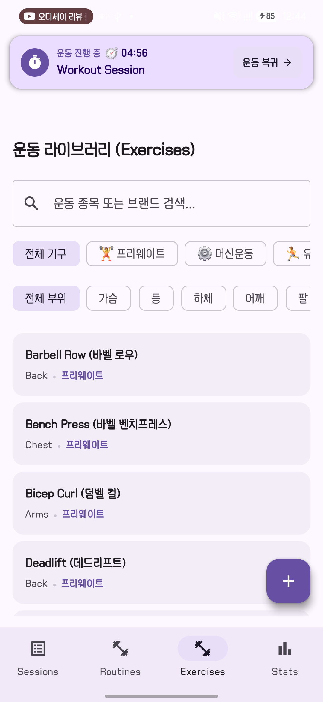

#### Key UI Elements
- Search bar, dual row filter chips (Equipment & Muscle Groups), exercise card directory, and FAB `+` for custom exercise creation.

#### UX Evaluation Criteria
- Effortless discoverability across extensive exercise catalogs.

---

### [Screen 10-B & C] Custom Exercise Creation Dialog
- **Files**: `10_add_exercise_dialog.png`, `10_add_exercise_dialog_machine.png`
- **Category**: Modal Dialog - Add Custom Exercise

| Standard View | Machine View with Brand Chips |
| :---: | :---: |
| 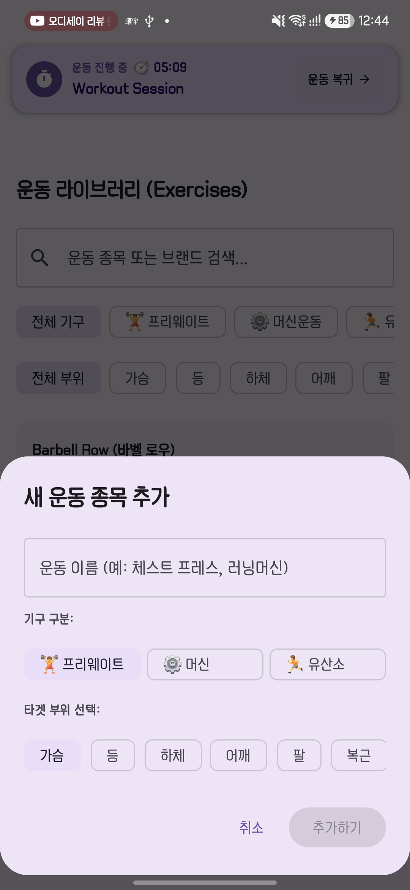 | 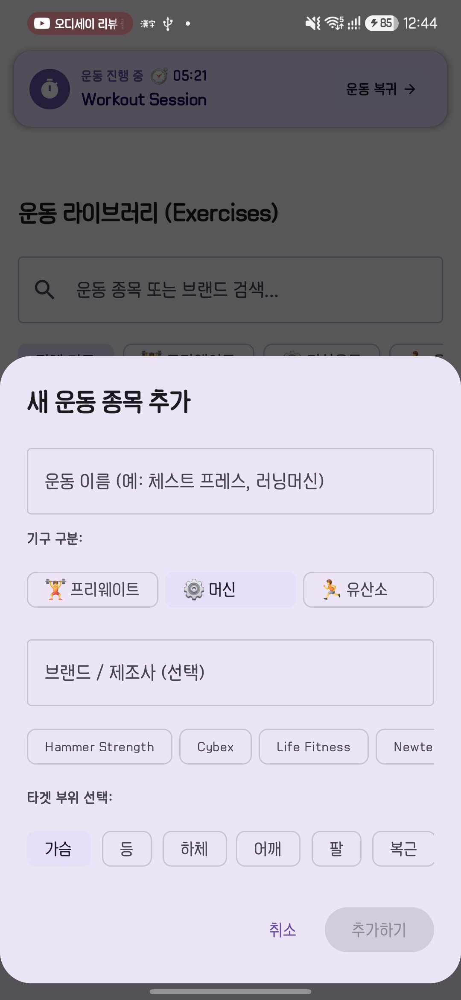 |

#### Key UI Elements
- Exercise name input, equipment selector (`Free Weight`, `Machine`, `Cardio`), dynamic brand recommendations (`Hammer Strength`, `Cybex`, `Life Fitness`, `Newtech`), and target muscle chips.

#### UX Evaluation Criteria
- 1-touch gym machine brand tagging without manual text input.

---

### [Screen 11] Statistics & Data Management Dashboard
- **File**: `11_statistics_dashboard.png`
- **Category**: Stats Tab

#### Key UI Elements
- **Backup & Restore**: `[⬆ JSON 백업]`, `[⬇ JSON 복원]` ensuring full offline data ownership.
- **Volume Metrics**: 30-day cumulative volume summary (`09-12 920.0 kg`).
- **Personal Records**: Estimated 1RM PR table per exercise.

#### UX Evaluation Criteria
- Clean, focused layout highlighting personal progression and data portability.

---

### [Screen 12] Android System Status Bar Chronometer Notification
- **File**: `12_system_notification_timer.png`
- **Category**: System Notification - Foreground Service

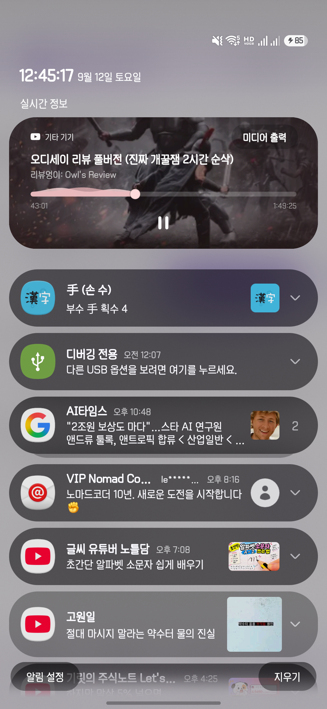

#### Key UI Elements
- **Native Android Chronometer (`WorkoutTimerService`)**:
  - Live elapsed workout time visible in the Android status bar and notification shade even while using other apps.
  - Zero battery consumption via OS hardware chronometer (`setUsesChronometer(true)`).
  - 1-tap return to the ongoing Liftory session.

#### UX Evaluation Criteria
- Unintrusive multitasking timer replacing annoying floating popups.

---

## 3. Summary Index of Screenshot Artifacts

| No. | Filename | Screen & State | Primary UX Highlight |
| :--- | :--- | :--- | :--- |
| 01 | `01_session_detail_empty.png` | Session Detail (Initial) | Live elapsed timer, quick rest chips, clear empty state call-to-action |
| 02 | `02_exercise_picker_cardio.png` | Exercise Picker (Cardio) | Chip-based instant filtering, search, brand sub-labels |
| 03 | `03_set_editor_weight.png` | Set Editor (Weight) | Compact 3-col layout, dynamic Epley 1RM badge, quick weight chips |
| 04 | `04_set_editor_cardio.png` | Set Editor (Cardio) | Adaptive `Speed/Time` labels, `+5min` duration chips, clean layout |
| 05 | `05_session_detail_logged.png` | Session Detail (With Sets) | Dual weight/cardio tables, auto-rest timer bar, per-exercise notes |
| 06 | `05_session_finish_dialog.png` | Finish Workout Dialog | Summary stats, celebration prompt, accidental finish guard |
| 07 | `07_session_conflict_dialog.png` | Single Session Conflict Dialog | Prevents concurrent sessions with 3-way conflict resolution |
| 08-A | `08_session_list_active.png` | Session List (Active) | Persistent `ActiveWorkoutBanner`, `[🔥 진행 중]` bento highlight |
| 08-B | `08_session_list_completed.png` | Session List (Completed) | Duration format, calendar date badge, smooth banner dismissal |
| 09-A | `09_routine_list.png` | Routine Library | Preset preview, 1-touch `[▶ Start Session with Routine]` |
| 09-B | `09_routine_editor_dialog.png` | Routine Editor Dialog | Fast inline configuration of targets and exercises |
| 10-A | `10_exercise_library.png` | Exercise Library | 2-tier chip filters, machine brand tags, search |
| 10-B | `10_add_exercise_dialog.png` | Add Exercise Dialog | Equipment classification and target muscle chips |
| 10-C | `10_add_exercise_dialog_machine.png` | Add Exercise (Brands) | Dynamic brand recommendation chips for gym equipment |
| 11 | `11_statistics_dashboard.png` | Stats & Backup | Local JSON export/import, volume tracking, PR records |
| 12 | `12_system_notification_timer.png` | Status Bar Timer Notification | Zero-battery OS native chronometer notification |
