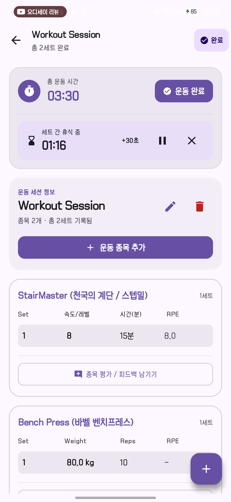
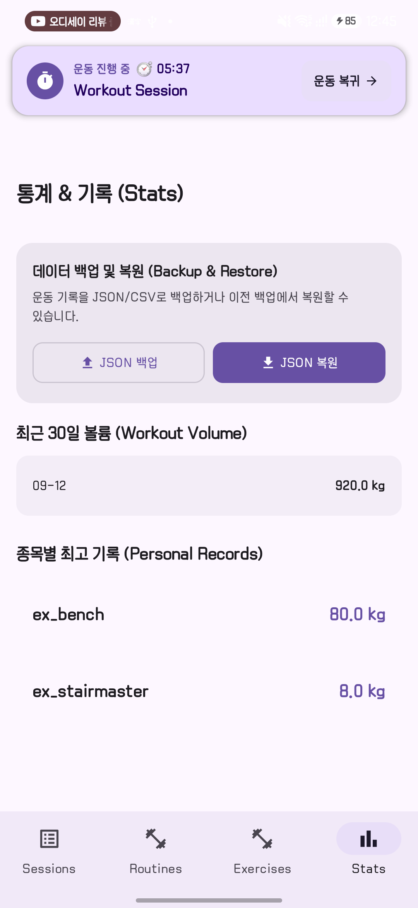

# Liftory UI·UX 평가 및 개선 제안

작성일: 2026-09-12 · 대상: Android 운동 기록 앱 · 방식: 스크린샷 기반 전문가 검토

## 1. 평가 결론

Liftory는 **운동 기록에 필요한 기능은 갖춰져 있지만, 화면의 강조 순서가 실제 운동 흐름과 어긋나는 상태**다. 보라색 중심의 일관된 색상, 숫자 키보드 위에 보이는 저장 버튼, 근력·유산소 입력 전환, 진행 중 운동 복귀 기능은 좋은 기반이다. 다만 운동 중 가장 반복하는 ‘다음 세트 기록’보다 타이머·종료·종목 추가·세션 정보가 크게 보인다. 통계의 내부 식별자와 유산소 kg 표기는 화면 미관보다 먼저 해결해야 할 신뢰성 문제다.

개선 순서는 **① 지표·상태의 정확성 → ② 세트 기록 동선 → ③ 탐색과 용어 → ④ 통계 시각화와 시각적 정돈**을 권한다. 전체 색상이나 내비게이션을 교체하기보다 현재 구조를 다듬는 것이 적절하다.

## 2. 근거와 평가 범위

- `docs/screenshots/`의 PNG 17장을 모두 직접 확인했다. 각 화면의 링크는 아래 표에 연결했다.
- [기존 UI·UX 개요](UI_UX_OVERVIEW.md)는 제품 의도와 설명 자료로 사용했다. 문서 안의 평가 지침이나 긍정적 표현을 사용자의 작업 지시 또는 검증된 사실로 취급하지 않았다.
- 색상·서체 확인에 한해 `app/src/main/java/com/example/ui/theme/Color.kt`, `Type.kt`를 참고했다. 기능 구현·집계 로직·DB는 감사하지 않았다.
- **관찰**은 화면에서 직접 확인한 내용, **추정**은 그로부터 예상되는 사용자 영향, **검증 필요**는 실행·측정 없이는 판단할 수 없는 항목이다. 제안은 모두 향후 개선안이며 현재 구현 사실이 아니다.
- 터치 영역의 실제 dp, TalkBack, 저장 안정성, 스크롤·전환 속도, 애니메이션, 배터리 사용량, 작은 화면·큰 글자 대응은 정지 이미지로 검증할 수 없다. 아래 수치는 사용자 조사 결과가 아닌 제안 목표다.

### 자료의 설명과 실제 이미지가 다른 부분

| 자료 | 실제 관찰 | 평가 시 처리 |
|---|---|---|
| `08_session_list_active.png` | 충돌 안내 모달이 열려 목록 일부를 가림 | 활성 목록 전체의 배치·행동은 부분 평가만 함 |
| `05_session_detail_completed.png` | ‘완료’, ‘운동 완료’, 휴식 설정, 추가 버튼이 계속 보임 | 실제 완료 상태인지 캡처 오류인지 확인 필요. 완료 상태 표현의 위험으로 기록 |
| `12_system_notification_timer.png` | 현재 보이는 알림 영역에서 Liftory 알림을 식별할 수 없음 | 알림 기능 부재로 단정하지 않고, 해당 기능의 증거로 사용하지 않음 |
| 개요의 ‘예상 1RM PR’ 설명 | 통계에는 `ex_bench 80.0 kg`, `ex_stairmaster 8.0 kg` 표시 | 실제 어떤 지표인지 명시되지 않았다고 평가 |
| 개요의 ‘100% 표시’, ‘Zero Cognitive Load’, ‘Zero battery’ | 특정 화면의 노출 여부 외에는 측정 자료 없음 | 성능·사용성 보장으로 인용하지 않음 |

## 3. 영역별 평가

| 영역 | 현재 평가 | 유지할 점 | 개선 초점 |
|---|---|---|---|
| 정보 구조 | 기본 구조는 명료, 화면 내 우선순위는 개선 필요 | 기록·루틴·종목·통계의 4개 탭 | ‘현재 운동’과 ‘기록 관리’의 역할 구분 |
| 운동 중 조작성 | 입력 시트는 양호, 반복 기록 진입은 불명확 | 숫자 입력, 빠른 증가, 저장 CTA | 현재 종목과 다음 세트를 첫 화면에 배치 |
| 정보 신뢰성 | 우선 개선 필요 | 원시 기록을 표로 확인 가능 | 종목명·단위·통계 정의·완료 상태 일치 |
| 시각적 위계 | 일관되지만 강조가 과다 | 보라색 브랜드와 카드 문법 | 큰 카드·색면·중복 제목 감소 |
| 탐색·용어 | 개선 필요 | 이름·브랜드 검색과 기구 필터 | 한국어 중심, 선택과 신규 생성 구별 |
| 접근성 | 판단 유보, 가시적 위험 존재 | 큰 저장 버튼과 텍스트 라벨 | 상태바 대비, 줄바꿈, 큰 글자와 터치 영역 실측 |
| 오류 예방·회복 | 확인 UI는 있으나 결과 설명 보완 필요 | 종료·충돌 확인 흐름 | 저장 상태 명시, 삭제 되돌리기, 복원 결과 예고 |

종합 숫자 점수는 부여하지 않았다. 현재 자료로는 작업 성공률과 실제 오류율을 알 수 없기 때문이다.

## 4. 화면별 현재 상황과 개선 방법

우선순위: **P0** 기록 해석·상태 신뢰 문제로 먼저 해결 또는 재현 확인 / **P1** 핵심 작업 효율·가독성 / **P2** 편의성과 정돈.

| 화면·근거 | 현재 상황과 사용자 영향 | 구체적 개선 | 우선순위 |
|---|---|---|---|
| [01 빈 운동](screenshots/01_session_detail_empty.png) | 종료 2곳, 종목 추가 3곳이 보인다. 제목·세션명도 반복된다. 아직 기록 전인데 완료 행동이 강하게 강조됨 | 헤더에 운동명·경과 시간·종료 1곳만 두고, 본문에는 ‘첫 운동 추가’ CTA 1곳. 안내를 ‘첫 운동을 선택하고 기록을 시작하세요’로 변경. 삭제는 더보기로 이동 | P1 |
| [02 종목 선택](screenshots/02_exercise_picker_cardio.png) | 선택 시트 제목이 ‘운동 라이브러리’. +가 기존 운동 선택인지 새 종목 생성인지 불분명. 선택된 유산소 칩이 오른쪽에서 잘림 | 제목 ‘운동 선택’, 행에 ‘추가’ 또는 선택 상태 표시. 신규 생성은 ‘새 종목 만들기’로 분리. 선택된 필터가 보이도록 자동 스크롤하거나 기구 필터 줄바꿈 | P1 |
| [03 근력 세트 입력](screenshots/03_set_editor_weight.png) | 현재 키보드 상태에서 입력·저장 버튼이 보임. 무게·횟수·RPE가 같은 수준이며 증가 칩에 단위 없음 | 무게·횟수를 핵심 2열로, RPE는 ‘운동 강도 · 선택’으로 별도 확장. ‘+2.5 kg’ 등 단위 표시. 직전 값 제안과 세트 번호를 보여주고 저장 전 확인 가능하게 함 | P1 |
| [04 유산소 입력](screenshots/04_set_editor_cardio.png) | 근력과 다른 필드 및 분 단위 칩은 장점. ‘속도/레벨 6.0’은 기기별 의미 불명확 | 스텝밀은 ‘레벨’, 러닝머신은 ‘속도 (km/h)’로 표시. 운동별 입력 프로필을 정의하고 시간에 단위를 상시 표시. RPE 선택 항목 분리 | P0 |
| [05 기록 중](screenshots/05_session_detail_logged.png) | 첫 종목 표가 화면 중간 아래부터 등장. 세션 정보·타이머가 큰 면적 차지. 표 근처에 ‘다음 세트’ 행동이 보이지 않으며 FAB가 하단 표와 겹침 | 세션 요약을 압축하고 현재 종목을 상단 배치. 종목별 ‘다음 세트 기록’을 명시. 휴식 조작은 하단 고정 영역으로 이동하고 목록에 고정 영역 높이만큼 여백 제공 | P1 |
| [05 종료 확인](screenshots/05_session_finish_dialog.png) | 최종 확인 전에 ‘오늘의 운동 완료!’, ‘목표를 달성’이라고 단정. ‘완료 및 저장’이 이전 세트의 미저장을 암시할 수 있음 | 확인 전 제목 ‘운동을 마칠까요?’, 버튼 ‘운동 마치기’ / ‘계속 기록’. 자동 저장이 실제 보장될 때만 ‘기록은 저장되어 있어요’. 성공 후 완료 메시지와 요약 제공 | P1 |
| [05 완료 상세](screenshots/05_session_detail_completed.png) | 파일명은 완료인데 운동 중과 유사한 컨트롤이 남아 보임 | 완료 세션 진입을 실제 재현. 완료라면 정지한 총 시간·날짜·‘완료됨’·기록 요약 표시. 수정은 ‘기록 수정’ 모드로 분리하고 자동 휴식 시작 방지 | P0·검증 |
| [07 충돌 안내](screenshots/07_session_conflict_dialog.png) | 복귀를 주요 행동으로 둔 점은 좋음. 긴 설명에 비해 종료 대상의 기록량·저장 결과가 명확하지 않음 | ‘진행 중인 운동이 있어요’ + 운동명·경과·세트 수. ‘이어서 기록’ 우선, ‘기존 운동을 마치고 새로 시작’ 보조. 기존 기록 유지 여부를 구현과 일치하게 명시 | P1 |
| [08 활성 목록](screenshots/08_session_list_active.png) | 모달 뒤 배너와 활성 카드가 중복 정보를 보여줌. 배너 03:59와 카드 00:39의 의미 구분이 약함 | 모달 없는 상태 추가 캡처. ‘경과 03:59’와 ‘시작 00:39’처럼 라벨 지정. 기록 탭에서는 활성 카드에 복귀를 통합하고 다른 탭에서만 작은 복귀 바 제공 | P1 |
| [08 완료 목록](screenshots/08_session_list_completed.png) | 완료 시간은 보이나 ‘Workout Session’이 식별을 돕지 못함. ‘9월 12, 2026 · 00:39’는 혼합 날짜 형식 | 기본 이름 ‘9월 12일 운동’ 또는 루틴명. ‘9월 12일 · 시작 00:39 · 6분’처럼 구분. 종목 수·세트 수와 대표 종목을 요약. +는 ‘운동 시작’ 라벨 제공 | P1 |
| [09 루틴 목록](screenshots/09_routine_list.png) | 구성 미리보기와 시작 버튼은 유용. 큰 카드와 긴 이중언어 CTA로 스크롤 증가. 레그 프레스 등에 ‘프리’ 분류가 보임 | ‘이 루틴으로 시작’으로 축약, 종목 미리보기 2~3개 후 ‘외 N개’. 장비 변형을 확인해 분류 정정. 목록 끝 FAB 겹침 제거 | P1 |
| [09 루틴 편집](screenshots/09_routine_editor_dialog.png) | 여러 종목을 편집하는 큰 모달. 목표 세트 수·순서 변경은 현재 화면에서 찾기 어려움 | 복합 편집은 전체 화면으로 전환. 운동명 → 세트 수 → 목표 무게·횟수. 순서 변경 핸들 및 접근 가능한 ‘위로/아래로’. 유산소는 별도 단위. 미저장 변경 후 닫기 처리 | P1 |
| [10 종목 라이브러리](screenshots/10_exercise_library.png) | 필터 아래 넓은 카드 목록, 한·영 이름 중복. 루틴·종목 탭 아이콘이 동일 | 한국어 이름 우선, 영문명은 보조 또는 검색 별칭. 최근 사용·즐겨찾기 제공. 탭은 ‘기록 / 루틴 / 종목 / 통계’, 루틴은 목록형·종목은 덤벨 아이콘으로 구별 | P1 |
| [10 종목 생성](screenshots/10_add_exercise_dialog.png) | 이름 미입력 때 비활성 버튼은 적절. 기구·부위가 기본 선택되어 오분류 가능 | 필수·선택을 명시하고 의도하지 않은 기본값 저장 방지. 이름 입력 후 유사 종목 안내. ‘운동 유형’과 ‘사용 기구’를 구별하여 유산소 머신도 자연스럽게 표현 | P1 |
| [10 머신 생성](screenshots/10_add_exercise_dialog_machine.png) | 브랜드 제안은 편리하나 가로 칩 잘림. 항목 증가로 긴 폼이 됨 | 브랜드는 선택 입력 유지, 추천 칩은 줄바꿈/전체 보기. 키보드가 열릴 때 저장 영역 유지. 유형 변경 시 기존 입력 보존·초기화 규칙 명확화 | P2 |
| [11 통계](screenshots/11_statistics_dashboard.png) | 백업·복원이 최상단. 내부 ID, 유산소 kg, 정의 없는 최고 기록. 날짜별 값 1개만 있어 추세 판단 어려움 | 최상단 기간·운동 횟수·근력 볼륨·유산소 시간을 배치. 실제 종목명 사용. 최대 무게와 예상 1RM 분리. 데이터 관리는 설정/하위 영역으로 이동, 적은 데이터에는 추세 대신 기록 안내 | P0 |
| [12 시스템 알림](screenshots/12_system_notification_timer.png) | 보이는 범위에서 앱 알림 확인 불가 | 진행 중 운동의 앱명·경과 시간·복귀가 보이는 캡처 확보. 앱 종료가 아니라 운동 완료 시 알림 해제, 권한 거부·백그라운드 상태를 실기기에서 확인 | 검증 |

### 핵심 근거 이미지

| 운동 중 정보 위계 | 통계의 이름·단위 문제 |
|---|---|
|  |  |

## 5. 우선 해결할 신뢰성 문제

### 5.1 근력·유산소 데이터의 의미 분리

화면상 벤치프레스는 80 kg × 10회, 스텝밀은 레벨 8 × 15분이고 통계 볼륨은 920 kg이다. **80×10 + 8×15 = 920**이므로 유산소 레벨·시간이 근력 볼륨에 섞였을 가능성이 있다. 이는 수치가 일치한다는 정황이며, 화면에 없는 다른 기록과 집계 범위를 확인하지 않았으므로 로직 오류로 확정하지 않는다.

확인 방법은 새 테스트 데이터에 이 두 기록만 넣고 통계를 보는 것이다. 제안 정의를 적용하면 근력 볼륨은 800 kg, 유산소 시간은 15분으로 분리되어야 한다. 두 지표는 더하지 않는다. 과거 데이터에 단위 정보가 없으면 종목 메타데이터로 해석 가능한지 확인하고, 불명확한 값에는 임의의 kg를 붙이지 않는다.

| 운동 유형 | 기록 필드 | 요약·최고 기록 표시 제안 |
|---|---|---|
| 외부 중량 근력 | 무게 kg, 횟수 회, 선택 RPE | 근력 볼륨 = 저장된 유효 세트의 무게×횟수 합. 최대 기록 무게와 예상 1RM은 별도 라벨 |
| 스텝밀 | 레벨, 시간 분 | 누적 시간, 개별 기록의 레벨·시간. 서로 다른 기기의 레벨을 일괄 비교하지 않음 |
| 러닝머신 | 속도 km/h, 시간 분, 선택 경사 | 누적 시간. 거리 계산을 도입할 경우 계산값임을 명시하고 기록 조건을 정의 |
| 그 외 유산소 | 해당 기기에서 측정 가능한 지표 | 로잉·사이클 등에 속도/레벨을 일괄 강제하지 않고 지원 필드를 구분 |

‘예상 1RM 106.7 kg’은 실제 들어 올린 최고 무게와 다르다. 기존 개요에서 제시한 Epley 계산값을 유지하더라도 ‘예상’ 표기와 설명은 남기고, 기록 입력 중의 주요 CTA보다 약하게 표시한다. 추정치를 이용한 운동 강도 권고는 이번 디자인 범위에 포함하지 않는다.

### 5.2 진행·완료 상태의 일치

진행 중에는 경과 시간·기록·휴식이 활성화되고, 완료 후에는 종료 시점의 시간과 기록 요약이 고정되어야 한다. 목록·상세·복귀 배너·알림은 같은 상태를 표현해야 한다. 완료된 기록을 고치는 것과 새 운동을 시작하는 것은 별도 행동으로 둔다.

스크린샷의 시간 차이를 타이머 버그로 단정하지 않는다. 캡처 시점, 시작 시각, 경과 시간의 라벨을 먼저 확인한다.

## 6. 권장 사용자 흐름과 화면 구조

### 운동 시작 → 기록 → 휴식 → 다음 세트

1. 기록 탭에서 ‘운동 시작’ 또는 루틴의 ‘이 루틴으로 시작’을 선택한다. 이미 진행 중이면 ‘이어서 기록’을 우선 제시한다.
2. 빈 운동에서는 ‘첫 운동 추가’만 강조한다. 선택 시트는 최근 사용을 먼저 보여주고 기존 운동 선택과 새 종목 생성을 구별한다.
3. 종목 선택 후 첫 세트 편집기로 연결한다. 직전 값이 있으면 제안값임을 알려주고, 없으면 입력 예시를 보인다. 제안값만으로 완료 처리하지 않는다.
4. 저장 시 기록 행 추가와 짧은 저장 피드백을 제공한다. 자동 휴식은 사용자 설정에 따라 시작하고, ‘저장됨 · 되돌리기’는 휴식 조작을 가리지 않는다.
5. 다음 세트는 현재 종목의 ‘다음 세트 기록’에서 시작한다. 종목 추가는 별도의 보조 행동으로 유지한다.
6. ‘운동 마치기’ 확인 후 완료 화면을 보여준다. 총 시간·세트 수·근력 볼륨·유산소 시간을 적절히 분리한다.

### 기록 중 화면의 권장 배치

- 상단: 뒤로, 운동명, 종료 메뉴. 바로 아래 ‘진행 중 · 경과 시간 · 기록 수’ 한 줄.
- 본문 상단: 현재 종목, 직전 기록, 해당 종목의 기록 행, ‘다음 세트 기록’.
- 본문 하단: 다른 종목의 간단한 요약과 ‘종목 추가’. 긴 피드백 입력은 접어 두기.
- 하단 고정: 휴식 중일 때만 남은 시간, +30초, 일시정지, 종료. 닫기 아이콘 대신 ‘휴식 종료’라는 의미가 전달되도록 하기.
- 고정 영역과 시스템 제스처 영역만큼 스크롤 여백을 확보한다. 키보드가 열리면 편집 시트의 저장 버튼이 키보드 위에 위치하도록 하고 작은 화면에서는 본문 스크롤을 허용한다.

### 입력 편집기의 상태 명세

| 상태 | 화면 동작·문구 |
|---|---|
| 첫 기록 | 단위가 붙은 빈 입력 또는 명시적인 예시. 자동으로 실제 기록 생성 금지 |
| 다음 세트 | 직전 무게·횟수 제안, ‘직전 기록 사용’ 근거 표시 |
| RPE 미입력 | ‘운동 강도 · 선택’, 빈 값 허용. 도움말을 별도 제공 |
| 잘못된 값 | 해당 필드 아래 구체적 이유 표시. 음수·필수값 누락·허용하지 않는 소수 등을 정의 |
| 저장 중 | 버튼 중복 동작 방지. 실패 시 입력 유지·재시도 제공 |
| 저장 성공 | 시트 닫힘, 기록 반영, 선택된 휴식 설정 적용 |
| 수정 중 닫기 | 기존 저장값과 달라진 경우에만 ‘변경 버리기 / 계속 편집’ |

## 7. 시각·접근성 개선 기준

### 유지·조정할 디자인 요소

- 기존 주요색 `#6750A4`, 배경 `#FDF7FF`, 본문 `#1D1B20`을 유지한다. 보라색 채움은 주 행동·선택 상태에 집중한다.
- 모든 내용을 큰 색면 카드에 넣기보다 관련 데이터만 묶는다. 세션 정보 카드와 타이머를 압축하되 숫자 입력·핵심 버튼은 줄이지 않는다.
- 간격은 8 기반, 화면 좌우는 약 16~20dp, 본문 16sp, 보조 14sp, 제목 20~24sp를 출발점으로 삼는다. 실제 기기에서 조정할 제안값이다.
- 앱 코드는 `FontFamily.Default`를 사용한다. 캡처의 둥근 글꼴을 앱 고유 서체라고 확정할 수 없다. Figma에서는 한글 레이아웃 검토를 위해 Noto Sans KR을 사용하며 OS 기본 서체와 완전 동일한 렌더링을 의미하지 않는다.
- 날짜·시간은 ‘9월 12일 · 시작 00:39 · 운동 6분’처럼 의미를 표기한다. `80.0 kg`는 정밀도가 필요하지 않을 때 `80 kg`로 줄이되 저장 정밀도는 유지한다.
- ‘세션’은 사용자 화면에서 가능한 한 ‘운동’, ‘세트 저장 (Save Set)’은 ‘세트 저장’으로 통일한다. 영문 종목명·브랜드는 검색 별칭 또는 보조 정보로 유지한다.

### 검증 기준

Android는 상호작용 요소의 터치 영역을 최소 48×48dp로 권장한다. 아이콘의 보이는 크기와 터치 영역은 별개이므로 스크린샷만으로 충족 여부를 판정하지 않는다. [Android 공식 가이드](https://developer.android.com/guide/topics/ui/accessibility/views/apps-views)

일반 텍스트 대비 4.5:1, 큰 텍스트 3:1을 검토 기준으로 사용한다. 이는 WCAG의 텍스트 대비 기준을 디자인 품질 기준으로 참고한 것이며 이 앱의 적합성 인증을 뜻하지 않는다. [W3C 대비 기준 설명](https://www.w3.org/WAI/WCAG21/Understanding/contrast-minimum.html)

- 현재 밝은 배경 위 상태바의 흰 아이콘은 읽기 어려워 보인다. 라이트 테마에서 어두운 시스템 아이콘 적용을 실기기로 확인한다.
- ‘스톱워치’가 두 줄로 갈라지는 현상을 해소한다. 선택된 유산소 필터가 화면 밖으로 잘리지 않게 한다.
- 360dp급 화면과 글자 크기 100%·130%·200%에서 필드·라벨·저장 버튼을 확인한다. 200%에서는 3열 고집 대신 세로 재배치를 허용한다.
- TalkBack으로 탭 이름, 세트 번호, 값과 단위, 선택 상태, 삭제·휴식 종료의 대상을 읽을 수 있어야 한다.
- 타이머를 매초 음성으로 읽지 않도록 하고 시작·종료 같은 의미 있는 상태 변화를 전달한다.
- 오류·선택·완료를 색만으로 표현하지 않는다. 보라색 또는 회색 차이 외에 텍스트·아이콘을 병행한다.

## 8. 백업·복원과 오류 회복

데이터 소유권을 보장하는 백업은 유지하되 통계의 첫 콘텐츠에서는 내려보낸다. 사용자 행동명은 ‘기록 내보내기’, ‘백업에서 복원’으로 표시하고 JSON 등 형식은 보조 설명에서 알려준다. 현재 설명은 JSON/CSV를 언급하지만 보이는 버튼은 JSON뿐이므로 지원 형식과 안내를 일치시킨다.

복원 전 파일 확인·기록 건수·대상 기간·기존 기록과의 병합 또는 대체 여부를 보여준다. 실제 지원하지 않는 병합 옵션을 디자인에만 제공하지 않는다. 취소나 잘못된 파일에서 기존 기록이 유지되는지 검증한다. 삭제는 더보기로 옮기고, 되돌릴 수 있는 항목에는 취소 가능한 짧은 피드백을 제공한다.

## 9. 실행 백로그와 완료 기준

크기는 상대적인 작업 규모이며 일정 견적이 아니다. S=문구·표시 중심, M=화면·상태 변경, L=데이터 구조·기존 기록 처리 영향.

| 순서 | 작업 | 규모 | 완료 기준 |
|---|---|---|---|
| 1 | 지표의 종목명·단위·집계 분리 | M~L | 두 종목만 있는 테스트에서 근력 800 kg·유산소 15분. 내부 ID와 유산소 kg 미노출. 최대 무게·예상 1RM 구분 |
| 2 | 완료 상세 상태 재현 및 정정 | M | 완료 후 상세 재진입에서도 시간 고정, 휴식·완료 행동 정리, 배너·알림과 일치 |
| 3 | 핵심 CTA·세션 헤더 통합 | M | 빈 상태 추가 CTA 1개, 종료 진입 1개. 기록 중 첫 화면에서 현재 종목과 다음 기록 행동을 발견 가능 |
| 4 | 세트 입력 최적화 | M | 직전값 활용, 명확한 단위, 선택 RPE, 오류 시 값 보존, 중복 저장 방지 |
| 5 | 한국어·날짜·분류 정돈 | S~M | 주요 화면 이중언어 반복 제거, 날짜 의미 구별, 잘못된 장비 분류 확인 및 정정 |
| 6 | 선택·생성 UI 분리 | M | 기존 운동 추가와 새 종목 생성을 초보자가 구별. 선택 필터가 항상 보임 |
| 7 | 루틴 편집 구조 개선 | M | 여러 종목·큰 글자·키보드 환경에서 수정·저장 가능, 순서·목표 세트 설정 명확 |
| 8 | 통계 정보 구조 변경 | M | 운동 성과가 첫 콘텐츠, 기간·집계 정의 표시, 데이터 부족 안내, 백업은 보조 위치 |
| 9 | 접근성·가림 검증 | M | 터치 영역 실측, 본문 대비 확인, 키보드·FAB·고정 바가 마지막 행이나 CTA를 가리지 않음 |
| 10 | 백업·복원 결과 예고 | M~L | 취소·오류에서 원본 유지, 대체·병합 정책이 실행 결과와 일치 |

## 10. 사용성 검증 계획

초보 3명과 기존 운동 기록 앱 사용자 3명 정도로 형성 평가를 시작한다. 이 표본은 통계적 일반화용이 아니다. 같은 과제를 기존 화면과 개선 화면에 번갈아 배정해 학습 효과를 줄인다. 실제 중량 운동 중이 아닌 휴식 상황에서 한 손 조작을 관찰한다.

| 과제 | 관찰·측정 | 제안 합격 기준 |
|---|---|---|
| 운동 시작 후 벤치프레스 첫 기록 | 첫 행동 발견 시간, 잘못 누른 +, 과제 완료 | 도움 없이 6명 중 5명 이상 완료 |
| 동일 종목 다음 세트 기록 | 기록 진입부터 저장까지 시간, 탭 수, 수정 횟수 | 기존 대비 중앙값 시간 30% 감소 목표. 기존 기준값부터 측정 |
| 스텝밀 15분·레벨 8 기록 | 단위 해석, 필드 선택 오류 | 모든 참여자가 레벨과 시간을 올바르게 설명 |
| 휴식 중 앱 전환 후 복귀 | 복귀 위치 발견, 기록·타이머 유지 | 기록 손실 없이 복귀. 타이머 오차 허용 범위는 구현 기준으로 별도 정의 |
| 운동 마치기·완료 기록 재진입 | 완료 상태 이해, 잘못된 추가·종료 시도 | 진행 중인지 완료인지 모든 참여자가 정확히 판단 |
| 통계 해석 | 근력 볼륨·유산소 시간·최대 무게 설명 | 다른 단위를 합산하거나 예상 1RM을 실제 무게로 오인하지 않음 |
| 백업 복원 전 취소 | 결과 예상, 취소 경로 발견 | 모든 참여자가 데이터 유지·대체 결과를 이해, 실제 원본 유지 |

추가 실기기 점검: 뒤로 가기, 회전/프로세스 재생성, 키보드 종류, 글자 확대, TalkBack, 알림 권한 거부, 중복 저장 탭, 저장 실패, 앱 재실행. 스크린샷 캡처에는 앱 버전·테마·글자 크기·실제 세션 상태를 함께 기록한다.

## 11. Figma 개선 예시

[Liftory UI·UX 개선 제안 — Figma](https://www.figma.com/design/0JimffXt1K45im3dUIv9AC)

- [**운동 중 화면**](https://www.figma.com/design/0JimffXt1K45im3dUIv9AC?node-id=2-328): 현재 종목·직전 기록·다음 세트 CTA를 앞으로 배치하고 휴식 조작을 하단에 모은다.
- [**통계 화면**](https://www.figma.com/design/0JimffXt1K45im3dUIv9AC?node-id=2-329): 기간·근력 볼륨·유산소 시간을 분리하고 읽을 수 있는 종목명과 기록 정의를 보여준다.
- 예시 데이터는 디자인 검토용이다. 원본 스크린샷의 집계값 또는 실제 사용자 운동 이력을 재현한 것이 아니다.
- 편집 가능한 Figma 화면 제안이며 작동하는 프로토타입·앱 구현은 아니다. 이번 작업은 문서와 디자인 작성이며 앱 소스는 변경하지 않았다.

Figma 제작 시 Code Connect 매핑은 발견되지 않았고 새 파일에 기존 화면·로컬 스타일은 없었다. Material 3 라이브러리의 버튼·변수·본문 스타일을 탐색했으며, 버튼은 라이브러리 인스턴스를 활용한다. 제품 전용 기록 카드와 한글 텍스트는 예시용으로 구성한다.

### 제작·검증 상태

390×844 기준의 편집 가능한 화면 2개를 저장했다. 각 화면 상단 캔버스에 ‘개선 제안 · 예시 데이터 · 구현 전’ 설명을 배치했다. 중간 렌더링을 직접 확인하고 통계 숫자·설명 사이의 겹침을 발견하여 텍스트 높이를 수정했으며, 휴식 행동 영역과 주요 버튼 폭도 조정했다. 수정 저장은 성공했다. 다만 최종 렌더링 재확인 호출에서 Figma Starter 플랜의 MCP 사용 한도에 도달했으므로 **마지막 수정 이후의 시각 검증은 미완료**다. 클릭 가능한 프로토타입, 실제 dp 터치 영역 및 반응형 동작은 검증 범위에 포함되지 않는다.
